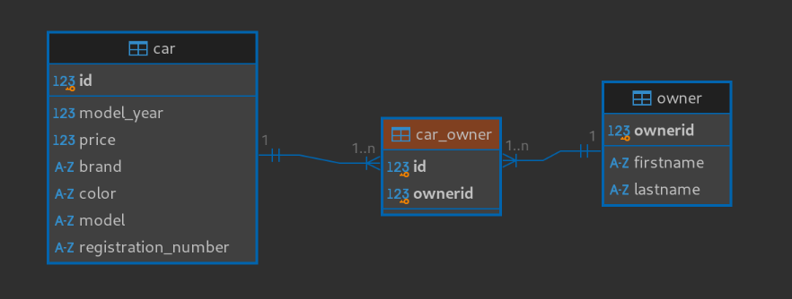
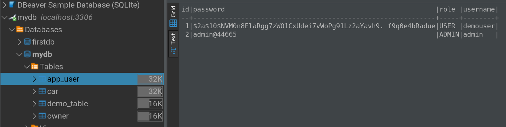
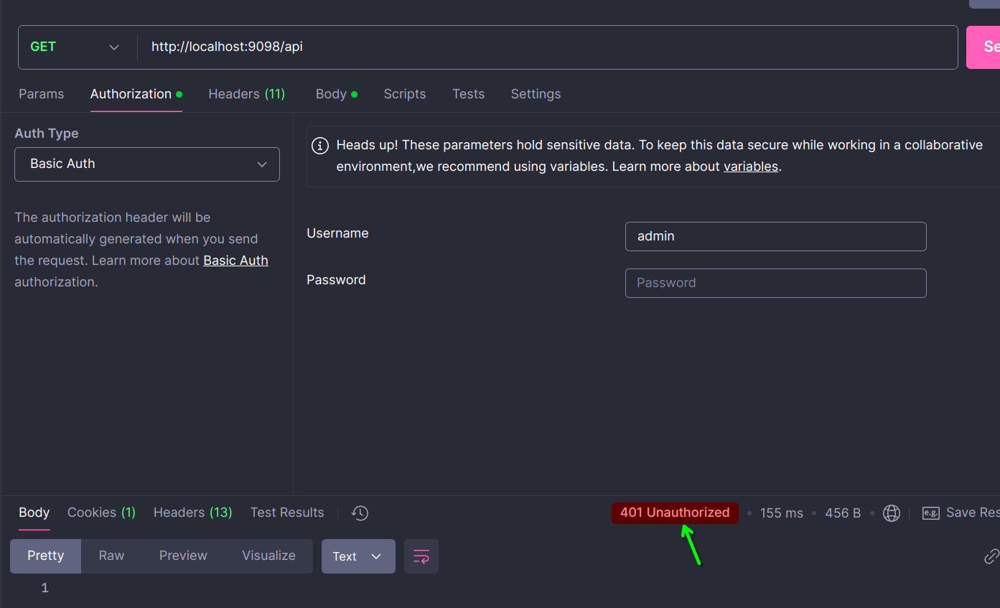
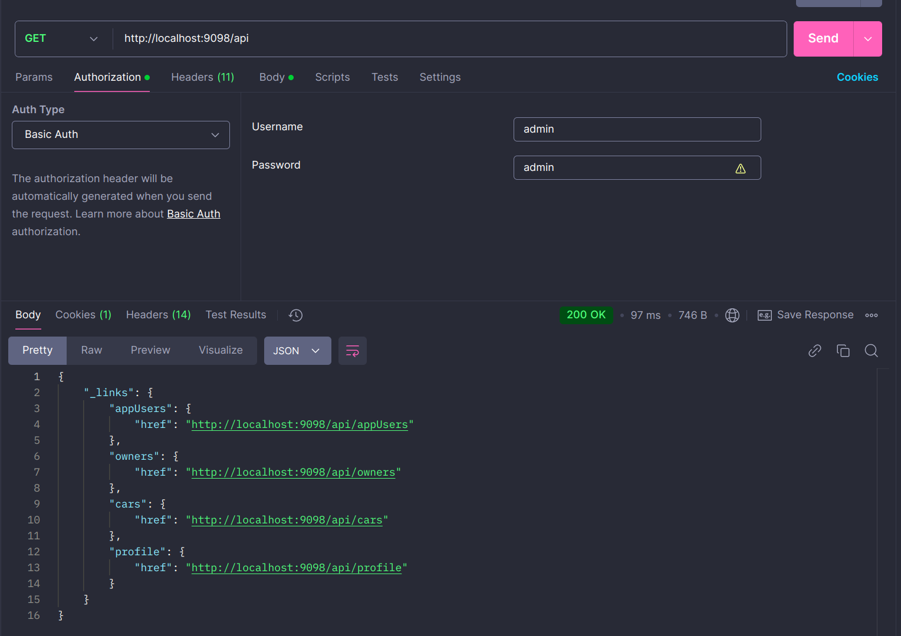
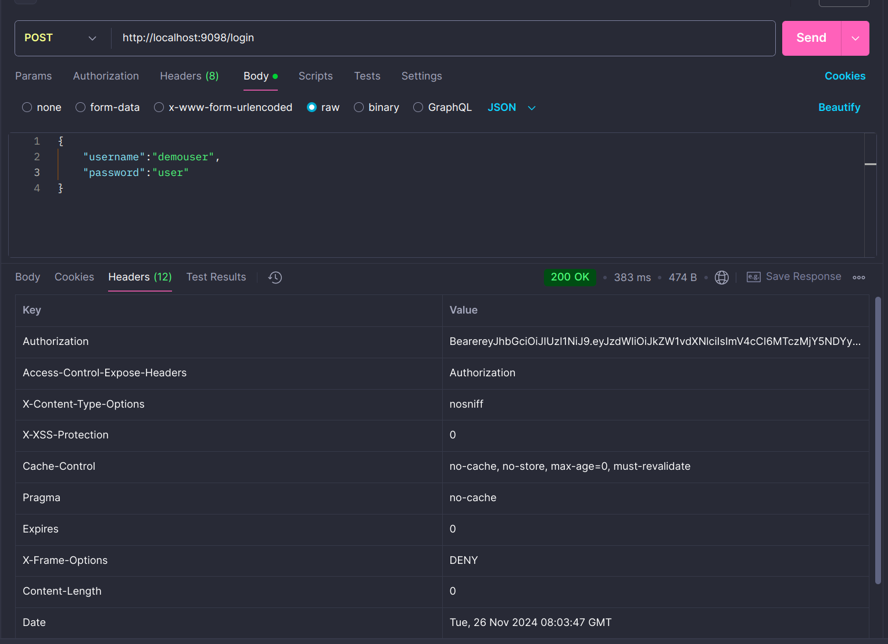
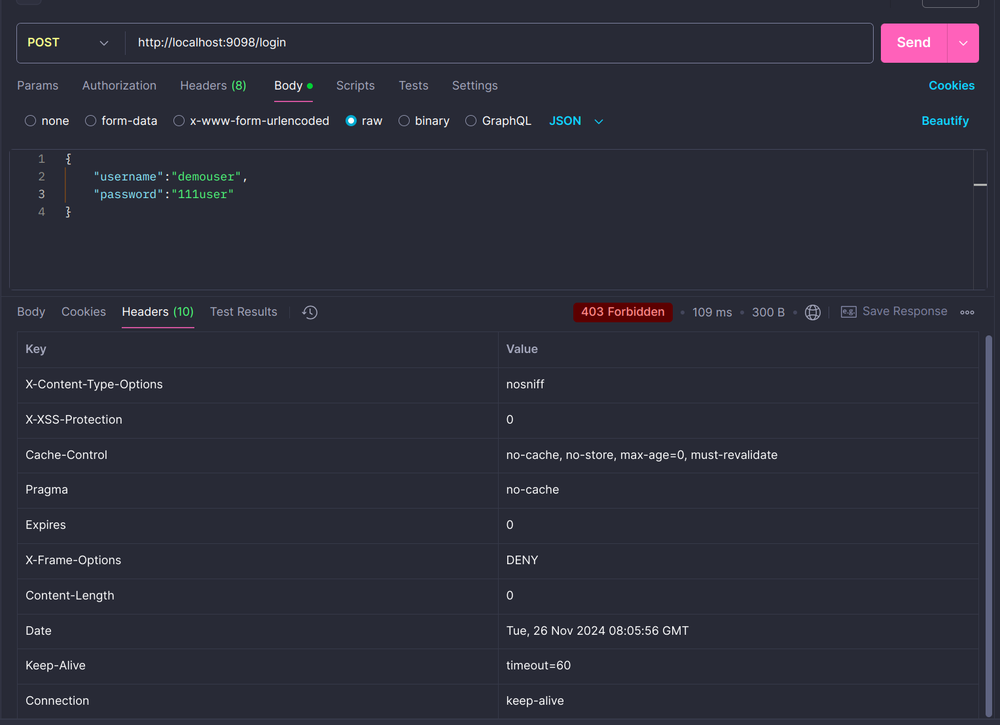
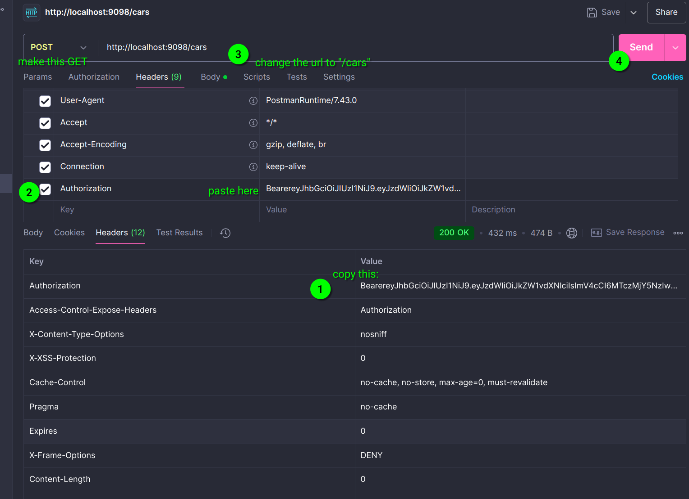
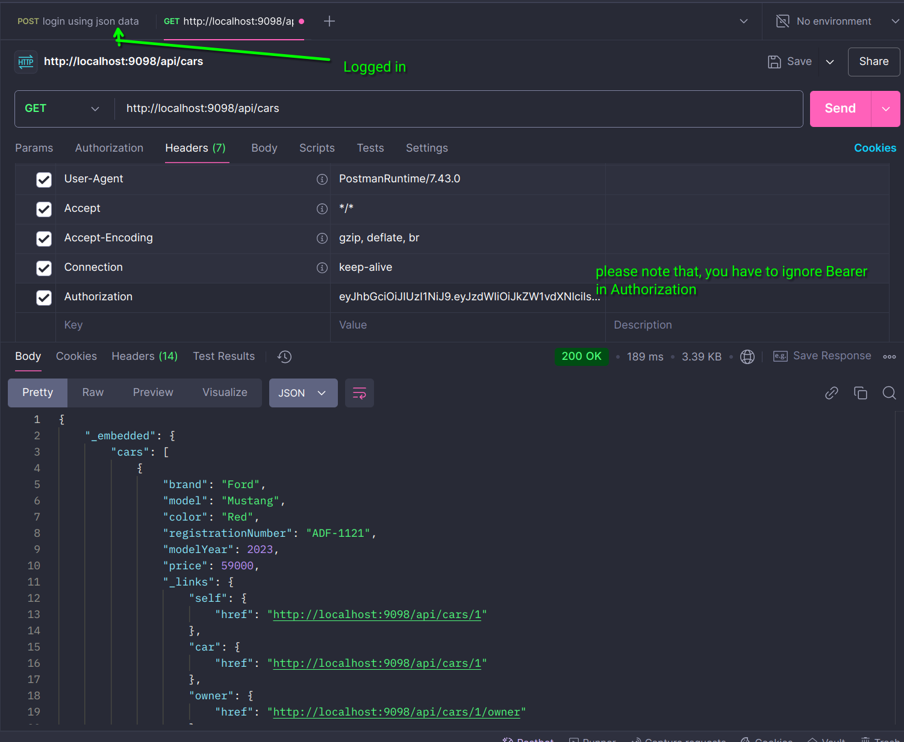

## add many to many relation

### for REST

check this url: `http://localhost:9098/api/`

### swagger ui 

check this location: `http://localhost:9098/swagger-ui/index.html`

### loggin in using admin

db:

### Securing the login

### Securing the other requests

yes we need to pass in the header value ( authorization as shown in the second pic)

- login:

- login with header and access cars

